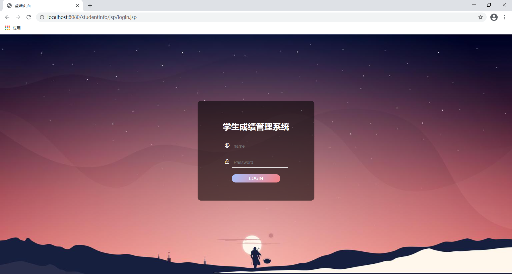
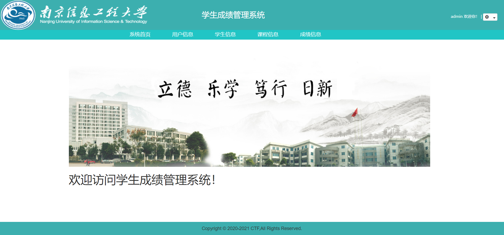
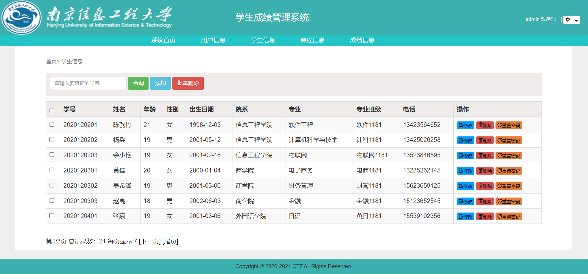
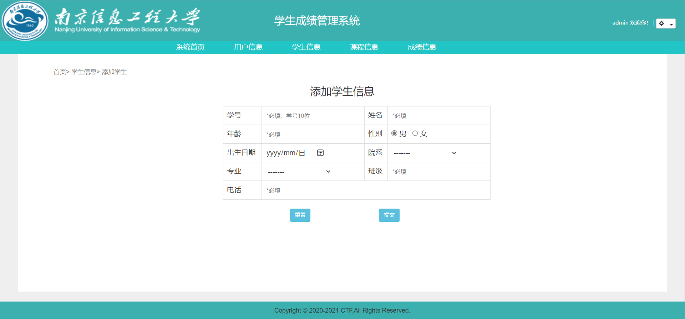

#### 学生成绩管理系统/学生信息管理系统

基于ssm + jsp开发的，使用Eclipse，连接MySQL数据库，存储学生的身份信息、成绩、课程信息，管理员的身份信息。

效果图在最后。有需要联系的看首页


#### 项目结构

```
studentinfo
	│
	├─img
    │
	├─sql
    │  └─studentinfo.sql   数据库脚本
    ├─src
    │  └─com
    │      └─chen
    │          ├─controller  
    │          ├─dao
    │          ├─pojo
    │          ├─service
    │          └─untils
    └─WebContent
        ├─css
        ├─img
        ├─js
        ├─jsp
        ├─META-INF
        └─WEB-INF
            └─lib       依赖包
```


#### 效果图

管理员登录效果图：



首页：



学生信息页面：



添加学生页面：



咨询我


---

